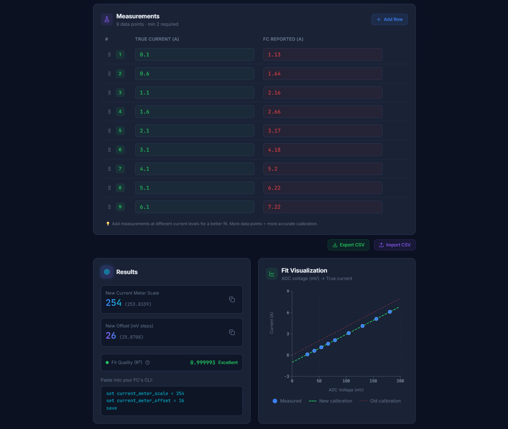

# FC Current Sensor Calibrator

This is a simple web tool to calibrate your flight controller's current sensor for **iNav**, **Betaflight**, and other firmware that uses scale/offset calibration.

> [!TIP]
> View the live tool here: [jwidess.github.io/fc-current-calibrator](https://jwidess.github.io/fc-current-calibrator)
>

   



## What It Does

Most flight controllers use a linear formula to convert the current sensor's ADC voltage reading into amps:

```
displayed_amps = (V_mV − offset) * 10 / scale
```

Where:
- **V_mV** is the raw ADC voltage in millivolts from the current sensor
- **scale** is the `current_meter_scale` parameter (e.g., 400 in Betaflight, 250 in iNav)
- **offset** is the `current_meter_offset` parameter in millivolt steps (default: 0)

This tool helps you find the correct **Scale** and **Offset** values by comparing your FC's default/stock readings against a known-accurate current measurement (e.g., from a benchtop power supply or inline current meter).

### How It Works

1. Enter your FC's **present** Scale and Offset values. These are used to back-calculate the ADC voltage:
   ```
   V_mV = FC_reading * scale / 10 + offset
   ```
2. Record paired measurements at different current levels:
   - **True Current**: what your accurate meter reads
   - **FC Reported**: what your flight controller reports
3. The tool runs a **least-squares linear regression** on the back-calculated ADC voltages vs. true current:
   ```
   true_current = slope * V_mV + intercept
   ```
4. The new config parameters are derived from the regression coefficients:
   ```
   new_scale  = 10 / slope
   new_offset = −intercept / slope
   ```

## What You Need

- A **benchtop power supply** with current readout, or an **inline current meter / clamp meter**
- An **adjustable or programmable load**, or just test a motor and ESC at different throttle levels
- Your FC's **present calibration values** from your configurator

## Features

- **Auto-save** - all data is persisted to browser localStorage via Zustand
- **CSV export/import** - save and restore your measurement data and results
- **CLI commands** - shows the exact `set` commands for Betaflight/iNav CLI
- **Built-in guide** - collapsible "How to Calibrate" section with step-by-step instructions
- **Calculation Breakdown** - showing each step of the math


## Tech Stack

- **React 19** + **TypeScript** - Type-safe component architecture
- **Vite 8** - Dev server and build tool
- **Tailwind CSS 4** - Styling
- **Zustand 5** - Lightweight state management with localStorage persistence
- **Recharts 3** - Charting library for scatter plot + regression line
- **Lucide React** - Icon set
- **dnd-kit** - Drag-and-drop toolkit for reordering measurements

## Credits: 
The following information was incredibly useful for developing this tool, Mr. D RC developed the original version of this tool, but I wanted to create something a bit more feature rich.
- mrd-rc.com: 
  - https://www.mrd-rc.com/tutorials-tools-and-testing/flight-controller-therapy/setting-the-current-sensor-in-inav/
  - https://www.mrd-rc.com/tutorials-tools-and-testing/inav-flight/current-sensor-scale-and-offset-calculation-how-it-works/
- oscarliang.com: https://oscarliang.com/current-sensor-calibration/

## AI Disclaimer: 
This project was developed with significant work from AI code generation tools, as I am still new to web development. However, I have tested this across 2x flight controllers thus far and it has worked perfectly for both. Please make sure to validate the generated results before trusting your current readings.

## License

GNU General Public License v3.0
